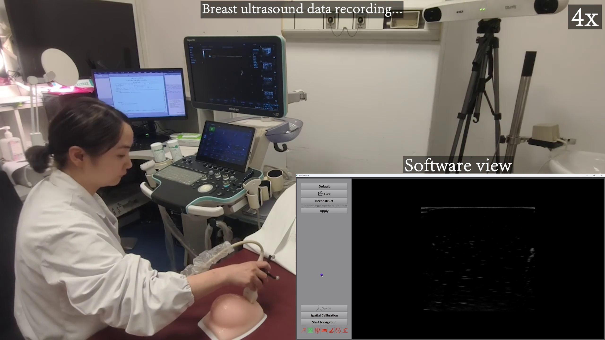
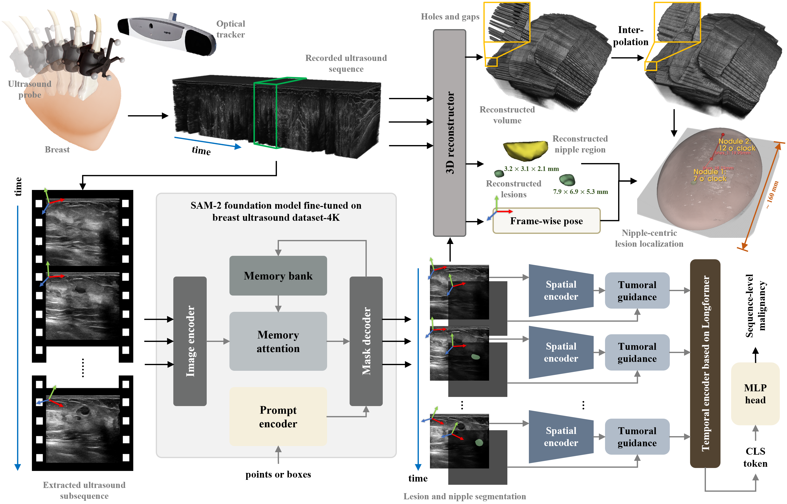
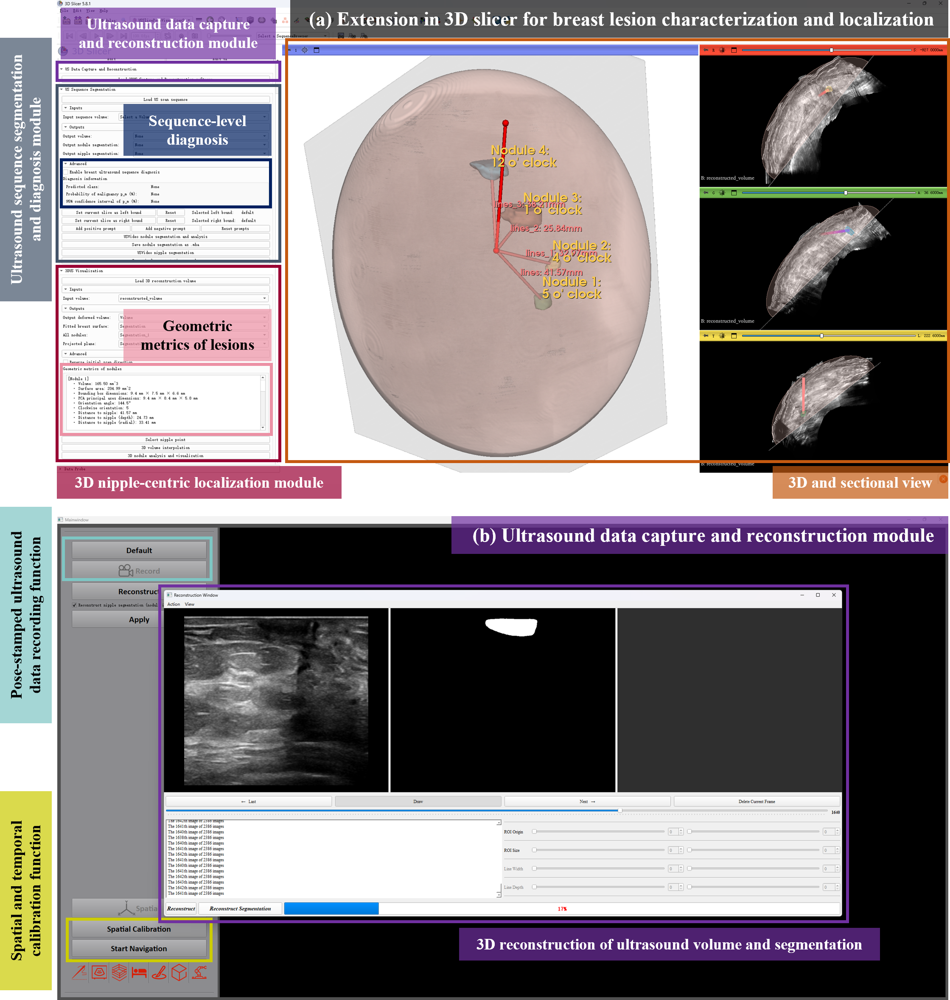

# 🩺 BreastLesion3DLocalizer

### A Navigation-Guided 3D Breast Ultrasound Scanning and Reconstruction System for Automated Multi-Lesion Spatial Localization and Diagnosis

*Official software and model code for our paper published in **Medical Image Analysis** (2026).*

[](https://doi.org/10.1016/j.media.2026.103965) [](LICENSE) [](https://www.python.org/) [](https://pytorch.org/) [](https://www.slicer.org/) [](https://youtu.be/wBAuzPZo6To)

---

## 🎬 Full-Pipeline Demo

[](https://youtu.be/wBAuzPZo6To)

▶️ **[Watch the full-pipeline demonstration on YouTube](https://youtu.be/wBAuzPZo6To).** The video walks through the complete workflow: optically tracked freehand scanning, real-time 3D reconstruction, nipple-centric lesion localization, and video-based malignancy diagnosis. *(Click the cover above to play it.)*

---

## 📖 Overview

Handheld ultrasound (HHUS) is indispensable for breast cancer screening, yet it remains compromised by operator-dependent acquisition, subjective 2D interpretation, and manual clock-face annotation. This project develops an **intelligent navigation-guided breast ultrasound scanning system** that delivers seamless **3D reconstruction**, **nipple-centric lesion localization**, and **video-based malignancy prediction**, with full adaptation to the routine clinical workflow.

The system couples precise 3D spatial annotation with foundation-model-enhanced spatiotemporal characterization. At its core are two innovations: a **Hybrid Lesion-informed Spatiotemporal Transformer (HLST)** that selectively fuses intra- and peri-lesional dynamics, augmented by a prompt-driven **BUS-SAM-2** foundation model, for sequence-level classification; and a **geometry-adaptive clock projection** method that standardizes clock-face orientation and lesion-to-nipple distance for breasts of arbitrary shape, eliminating the need for patient-attached fiducials or pre-marked landmarks.

> [!NOTE]
> This repository accompanies our paper *"A navigation-guided 3D breast ultrasound scanning and reconstruction system for automated multi-lesion spatial localization and diagnosis"*, published in **Medical Image Analysis** (vol. 110, 103965, 2026).
>
> **Released now:** the ultrasound **data capture & reconstruction module** and the **HLST** model code (with pretrained weights). **Coming soon:** the ultrasound sequence **segmentation & diagnosis module** and the **3D nipple-centric localization module**, which we are still organizing and verifying and will release shortly.

---

## 🩻 The Scanning System


A custom freehand 3D breast ultrasound system is assembled from off-the-shelf hardware: a clinical 2D ultrasound scanner, an **optical tracker**, and a mobile workstation. A lightweight 3D-printed adapter with passive marker spheres defines the probe coordinate frame; an improved **N-wire phantom** spatial calibration maps each image pixel into the probe frame, and tracker data are streamed via **OpenIGTLink** and ingested by the **PLUS Toolkit** in real time. Each B-mode frame is thus pose-stamped for accurate slice-to-volume compounding, with real-time alerts on tracking loss so the sonographer can rescan affected areas.

---

## 🔬 Pipeline



The end-to-end pipeline integrates four stages:

| Stage | Description |
| :--- | :--- |
| **1 · Tracked freehand acquisition** | Optically tracked scanning produces a spatially and temporally calibrated, pose-stamped B-mode sequence. |
| **2 · Segmentation & diagnosis** | A prompt-driven, memory-augmented **BUS-SAM-2** network extracts frame-wise nipple and lesion masks, which a **lesion-guided spatiotemporal encoder (HLST)** aggregates for sequence-level malignancy assessment. |
| **3 · 3D reconstruction** | Slice-to-volume bin-filling and gradient-aware hole-filling interpolation generate a hole-free 3D intensity volume together with binary nipple/lesion volumes. |
| **4 · Nipple-centric localization** | Fusing the volumes with per-frame poses enables standardized clock-face orientation, lesion-to-nipple distance, and 3D morphometric quantification within the reconstructed breast anatomy. |

---

## 🖥️ Software



The algorithms are deployed as **(a)** a **3D Slicer extension** for breast lesion characterization and localization, comprising the data capture & reconstruction module, the sequence segmentation & diagnosis module, and the 3D nipple-centric localization module; and **(b)** a standalone **ultrasound data capture & reconstruction module** that provides pose-stamped recording, spatial and temporal calibration, and real-time 3D reconstruction.

---

## ✨ Highlights

- An integrated, navigation-guided 3D breast ultrasound scanning and reconstruction system that extends the full clinical spectrum for preliminary breast lesion assessment.
- A Hybrid Lesion-informed Spatiotemporal Transformer augmented by BUS-SAM-2 foundation model for video-level breast lesion malignancy classification.
- A novel geometry-adaptive clock projection and analysis method based on handheld ultrasound for automated nipple-centric lesion 3D localization and quantification, without requiring additional pre-landmarking.
- Considerable clinical trials confirm the high accuracy and effectiveness of our proposed system.

---

## 📊 Results at a Glance

- **Spatial accuracy (phantom study).** On three breast phantoms, measurements correlated strongly with CT reference: *r* > 0.99 for distance, *r* > 0.97 for 3D size, and *r* = 1.00 for clockwise angle (*p* < 0.0001).
- **Clinical evaluation.** Across 43 female patients (30 abnormal breasts), median clock-face orientation and size discrepancies versus conventional reports were **0 h** and **0.7 mm × 0.6 mm**, respectively.
- **Video-based diagnosis (HLST on the public BUV dataset).** HLST achieved the best overall performance, surpassing strong video-classification baselines (C3D, SlowFast, TimeSformer, VideoSwin, UniFormerV2):

  | Method | Accuracy | Precision | Recall | F1 | AUC |
  | :--- | :---: | :---: | :---: | :---: | :---: |
  | TimeSformer (strongest baseline) | 78.6 | 80.0 | 84.5 | 82.1 | 78.6 |
  | **HLST (ours)** | **86.1** | **84.9** | **92.7** | **88.5** | **86.8** |

  HLST outperformed the leading alternatives by **7.5% / 4.9% / 7.1% / 6.4% / 8.0%** in accuracy / precision / recall / F1 / AUC (paired *t*-test, *p* < 0.05).

---

## 📦 Repository Structure

```
BreastLesion3DLocalizer/
├── HLST/                                   # Hybrid Lesion-informed Spatiotemporal Transformer (released)
│   ├── model.py                            # HLST model definition
│   ├── hlst_helper.py                      # Longformer temporal model & padding utilities
│   ├── hlst.yaml                           # Model configuration
│   ├── spatial_encoder/                    # Dual-stream CNN-Transformer spatial encoder (ConvFormer-MTL)
│   └── weights/                            # Pretrained weights (download from the GitHub release)
├── Ultrasound data capture and reconstruction module/   # Standalone capture & reconstruction app (released)
│   ├── packet/                             # Executable (3dus.exe) and runtime libraries
│   └── SettingData/                        # Probe configuration and calibration files
├── assets/                                 # Figures used in this README
├── LICENSE                                 # Apache-2.0
└── readme.md
```

---

## 🧠 HLST: Hybrid Lesion-informed Spatiotemporal Transformer

Sequence-level breast ultrasound video classification (benign vs. malignant) via a **dual-stream CNN-Transformer spatial encoder** (with lesion and tumoral guidance) and a **Longformer-based temporal encoder**. The global attention on the learnable `[CLS]` token reveals which frames the model considers most diagnostically significant, analogous to a sonographer's key-frame selection.

### Pretrained Weights

Available from the [**HLST Pretrained Weights** release](https://github.com/ZhyBrian/BreastLesion3DLocalizer/releases/tag/HLSTPretrainedWeights):

| File | Description | Source |
| :--- | :--- | :--- |
| `spatial_encoder_pretrained_weights.pth` | Spatial encoder (ConvFormer-MTL) | Pretrained on **Breast Ultrasound Image Dataset-4K** (4086 images from 4 public/private cohorts) for segmentation + classification |
| `hlst_temporal_transformer.pth` | Longformer temporal encoder | Pretrained on **large-scale natural video data** (NOT ultrasound) |
| `hlst_mlp_head.pth` | MLP classification head | Same natural-video pretraining |
| `hlst_cls_token.pth` | Learnable `[CLS]` token | Same natural-video pretraining |

> [!IMPORTANT]
> The temporal encoder and MLP head weights are **not** pretrained on ultrasound data, due to the lack of large-scale ultrasound video datasets. To use HLST on your own ultrasound video data, you **must** fine-tune at least the temporal encoder and MLP head (and ideally train end-to-end) on your target dataset.

### Dependencies

```bash
pip install torch torchvision transformers pyyaml
```

The spatial encoder module (`HLST/spatial_encoder/`) must be available on your Python path.

### Configuration

All model hyperparameters are specified in `HLST/hlst.yaml`:

```yaml
num_classes: 2
spatial_frozen: True          # True for inference, False for end-to-end training

spatial_args:
  img_size: 256
  in_chans: 3
  pretrained_weights: ./weights/spatial_encoder_pretrained_weights.pth

temporal_type: longformer
temporal_pretrained_weights: ./weights/hlst_temporal_transformer.pth
mlp_head_weights: ./weights/hlst_mlp_head.pth
cls_token_weights: ./weights/hlst_cls_token.pth
temporal_args:
  EMBED_DIM: 768
  NUM_ATTENTION_HEADS: 12
  NUM_HIDDEN_LAYERS: 3
  ATTENTION_MODE: 'sliding_chunks'
  ATTENTION_WINDOW: [18, 18, 18]
  # ... (see hlst.yaml for the full list)
```

### Loading the Model

```python
import yaml, torch
from argparse import Namespace
from model import HLST

def load_yaml(file):
    with open(file) as f:
        return Namespace(**yaml.load(f, Loader=yaml.FullLoader))

device = torch.device('cuda' if torch.cuda.is_available() else 'cpu')
cfg = load_yaml("./hlst.yaml")
model = HLST(**vars(cfg)).to(device)

# Load fine-tuned weights (after training on your ultrasound video dataset)
model.load_state_dict(torch.load("your_finetuned_weights.pth", map_location=device))
model.eval()
```

### Inference

The model expects input tensors of shape `(B, C, F, H, W)`, where `B` is the batch size, `C` the channels (3 for RGB), `F` the number of sampled frames, and `H`, `W` the spatial dimensions.

```python
# video_tensor: (B, 3, F, H, W), float32, normalized to [0, 1]
# position_ids: (B, F), int64, frame indices in the original sequence
with torch.no_grad():
    logits = model(video_tensor.to(device), position_ids=pos_ids.to(device))
    probs = torch.softmax(logits, dim=1)     # (B, 2)
    p_malignant = probs[:, 1]                 # malignancy probability
    pred_label = (p_malignant > 0.5).long()   # 0 = benign, 1 = malignant
```

**With BUS-SAM-2 lesion masks** (recommended, for HLST's tumoral guidance):

```python
# mask_tensor: (B, 1, F, H, W), binary lesion mask from BUS-SAM-2
logits = model(video_tensor.to(device), masks=mask_tensor.to(device), position_ids=pos_ids.to(device))
```

> When `spatial_frozen=True` (inference mode), `forward()` returns only the classification logits `(B, num_classes)`. For quicker inference, uniformly sub-sample `F` frames from the full sequence (e.g. take every `D // F`-th frame).

<details>
<summary><b>Training & fine-tuning</b> (click to expand)</summary>

To fine-tune HLST on your own breast ultrasound video dataset, set `spatial_frozen: False` to enable end-to-end training with multi-task supervision. When `spatial_frozen=False`, the model returns `(logits, out_f_mask, out_f_cls)`: the sequence-level logits, per-frame segmentation, and per-frame classification. You can design your own loss combination (the simplest supervises only the sequence-level logits with a weighted focal loss to address class imbalance).

#### Training configuration (reference)

| Parameter | Value |
| :--- | :--- |
| Optimizer | Adam |
| Learning rate | 1e-5 |
| Batch size | 2 |
| Epochs | 45 |
| Scheduler | CosineAnnealingLR |
| Training frames | 12 (randomly sampled) |
| Test frames | full sequence, or sub-sampled (e.g. 24, uniformly) for quicker inference |

#### Minimal training loop

```python
cfg = load_yaml("./hlst.yaml")
cfg_dict = vars(cfg)
cfg_dict['spatial_frozen'] = False          # enable end-to-end fine-tuning
model = HLST(**cfg_dict).to(device)

n_epoch = 45
optimizer = torch.optim.Adam(model.parameters(), lr=1e-5)
scheduler = torch.optim.lr_scheduler.CosineAnnealingLR(optimizer, T_max=n_epoch // 3, eta_min=1e-5 / 1000)

for epoch in range(n_epoch):
    model.train()
    for video, masks, label, pos_ids in train_loader:
        pred, out_f_mask, out_f_cls = model(video.to(device), masks.to(device), pos_ids.to(device))
        # pred, out_f_mask, out_f_cls = model(video, pos_ids)   # also OK when pixel-level mask labels are unavailable
        # ... compute your loss (e.g., weighted binary focal loss on `pred`) ...
        loss.backward()
        optimizer.step()
        optimizer.zero_grad()
    scheduler.step()
```

#### Temporal-encoder-only fine-tuning (faster, less GPU memory)

```python
cfg_dict['spatial_frozen'] = True           # freeze the spatial encoder
model = HLST(**cfg_dict).to(device)
trainable_params = list(model.temporal_transformer.parameters()) \
                 + list(model.mlp_head.parameters()) + [model.cls_token]
optimizer = torch.optim.Adam(trainable_params, lr=1e-5)
```

</details>

<details>
<summary><b>Temporal attention visualization</b> (click to expand)</summary>

Use `forward_att()` to extract the Longformer attention maps for interpretability analysis. The global attention on the `[CLS]` token reveals which frames the model considers most diagnostically significant.

```python
model.eval()
with torch.no_grad():
    attentions, global_attentions, num_frames = model.forward_att(
        video_tensor.to(device), position_ids=pos_ids.to(device)
    )
```

</details>

---

## 🩻 Ultrasound Data Capture & Reconstruction Module

The standalone capture & reconstruction application (under `Ultrasound data capture and reconstruction module/`) provides pose-stamped B-mode recording, spatial/temporal calibration, real-time navigation with tracking-loss alerts, and 3D volumetric reconstruction. It streams optical-tracker poses via OpenIGTLink and is built on the PLUS Toolkit, ITK, VTK, and OpenCV runtimes bundled in `packet/`.

---

## 📌 Citation

If you find this work useful, please cite:

```bibtex
@article{zhang2026navigation,
  title={A navigation-guided 3D breast ultrasound scanning and reconstruction system for automated multi-lesion spatial localization and diagnosis},
  author={Zhang, Yi and Yan, Yulin and Wang, Kun and Cai, Muyu and Xiang, Yifei and Guo, Yan and Tu, Puxun and Ying, Tao and Chen, Xiaojun},
  journal={Medical Image Analysis},
  volume={110},
  pages={103965},
  year={2026},
  publisher={Elsevier},
  doi={10.1016/j.media.2026.103965},
  url={https://www.sciencedirect.com/science/article/pii/S1361841526000344}
}
```

---

## 📧 Contact

For questions about the method or the software, please open an [issue](https://github.com/ZhyBrian/BreastLesion3DLocalizer/issues) or contact the authors:

- **Yi Zhang**, Shanghai Jiao Tong University ([@ZhyBrian](https://github.com/ZhyBrian))
- **Prof. Xiaojun Chen** (corresponding): `xiaojunchen@sjtu.edu.cn`
- **Prof. Tao Ying** (corresponding): `yingtaomail@yeah.net`

## 🙏 Acknowledgements

This work builds upon the open-source community, including [3D Slicer](https://www.slicer.org/), the [PLUS Toolkit](https://plustoolkit.github.io/), [OpenIGTLink](http://openigtlink.org/), [SAM-2](https://github.com/facebookresearch/sam2), and [Longformer](https://github.com/allenai/longformer). The HLST spatial encoder builds on our prior work on multi-task breast cancer diagnosis (IEEE J-BHI, 2024).

## 📄 License

This project is released under the [Apache License 2.0](LICENSE).
